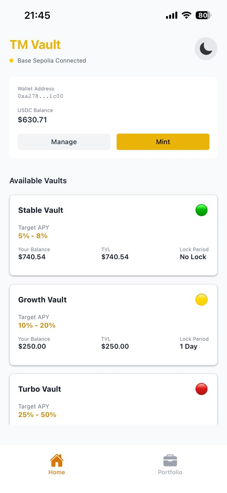
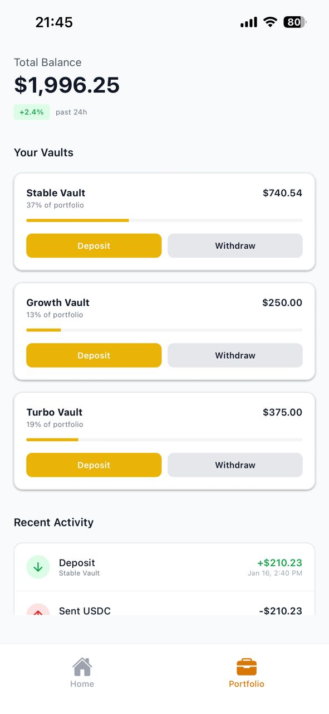
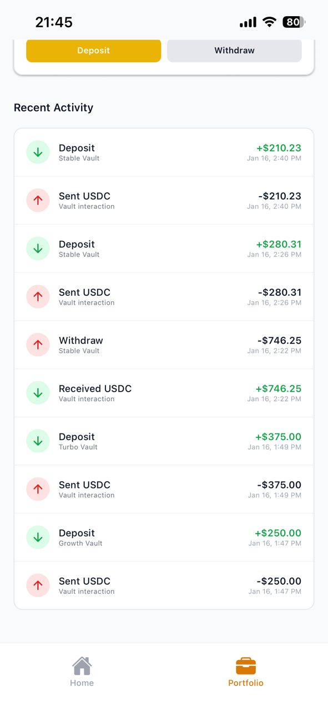
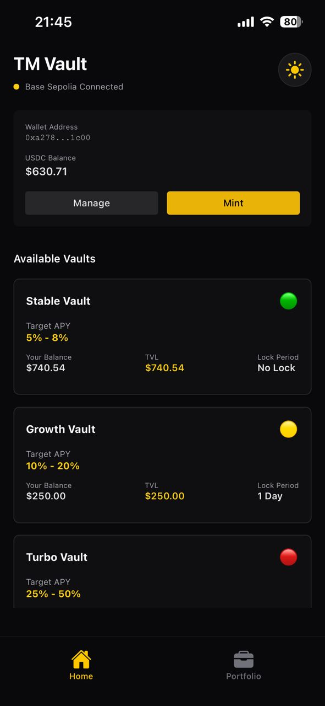
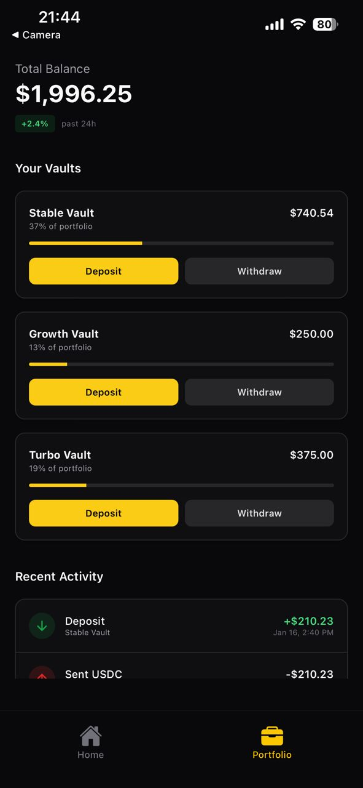
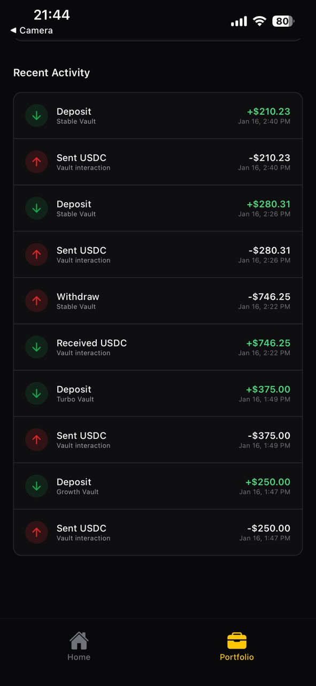

# TM-Vault

A mobile crypto investment management application built with React Native and Expo that enables users to deposit, manage, and track positions across multiple yield-generating vault strategies on the Base Sepolia blockchain.

## Features

### Multi-Strategy Vault Investment
- **Stable Vault** (Low Risk) - Blue-chip assets with stable returns
- **Growth Vault** (Medium Risk) - Balanced exposure to growth assets
- **Turbo Vault** (High Risk) - Leveraged strategies for boosted returns

### Core Functionality
- Deposit USDC to any vault with approval flow
- Request and execute withdrawals with lock periods
- Mint test USDC tokens on testnet
- Track all vault positions and performance
- View transaction history with blockchain explorer links
- Real-time balance updates

### User Experience
- Dark/Light mode support
- Haptic feedback on key interactions
- Toast notifications
- Pull-to-refresh
- Progress indicators for multi-step transactions

## Screenshots

| Home | Portfolio | Transaction |
|:---:|:---:|:---:|
|  <br/> Light |  <br/> Light |  <br/> Light |
|  <br/> Dark |  <br/> Dark |  <br/> Dark |

## Tech Stack

### Frontend
- **React Native** 0.81.5
- **Expo** 54.0.31
- **Expo Router** 6.0.21 - File-based routing
- **React** 19.1.0
- **TypeScript** 5.9.2

### Styling
- **NativeWind** 4.2.1 - Tailwind CSS for React Native
- **Tailwind CSS** 3.4.17
- **Lucide React Native** - Icons

### Blockchain & Web3
- **Wagmi** 2.5.20 - React Hooks for Ethereum
- **Viem** 2.9.31 - TypeScript Ethereum library
- **Web3Modal** 2.0.5 - Wallet connection UI
- **WalletConnect** 2.18.0 - Multi-chain wallet protocol

### State Management
- **Zustand** 5.0.0
- **TanStack React Query** 5.64.1
- **AsyncStorage** 1.24.0

### Navigation
- **React Navigation** 7.x (Bottom Tabs, Stack)

## Project Structure

```
TM-Vault/
├── app/
│   ├── _layout.tsx          # Root layout with Wagmi/Web3Modal setup
│   └── index.tsx            # Entry point
├── screens/
│   ├── RootNavigator.tsx    # Stack navigation (modals)
│   ├── TabNavigator.tsx     # Bottom tab navigation
│   ├── HomeScreen.tsx       # Main vault display
│   ├── PortfolioScreen.tsx  # Portfolio overview
│   └── RecentTransactionsScreen.tsx
├── components/
│   ├── VaultCard.tsx        # Individual vault display
│   ├── VaultCardWrapper.tsx # Wrapper fetching vault stats
│   ├── WalletSection.tsx    # Wallet connection & USDC minting
│   ├── DepositModal.tsx     # Deposit flow with approval
│   ├── WithdrawModal.tsx    # Withdrawal flow
│   └── ...                  # Other UI components
├── hooks/
│   ├── useTMVault.ts        # Vault contract interactions
│   └── useMockUSDC.ts       # USDC token interactions
├── contexts/
│   └── ToastContext.tsx     # Global toast notifications
├── utils/
│   ├── contracts.ts         # Contract addresses & config
│   ├── vaults.ts            # Vault metadata
│   └── formatters.ts        # Number/currency formatting
├── abis/
│   ├── TMVault.json         # Vault contract ABI
│   └── Erc20.json           # ERC20 token ABI
├── types/
│   └── index.ts             # TypeScript definitions
└── assets/
    └── images/              # App icons and splash screens
```

## Smart Contracts

### TM Vault Contract (Base Sepolia)
- **Address:** `0x603B85751ae55E050d3D38a51865c0AFa3379492`
- **Functions:**
  - `getVaultStats(vaultType)` - Fetch APY, TVL, lock periods
  - `getUserPosition(address)` - Get user's shares per vault
  - `deposit(assets, vaultType)` - Deposit USDC
  - `requestWithdrawal(shares, vaultType)` - Request withdrawal
  - `executeWithdrawal()` - Execute pending withdrawal
  - `cancelWithdrawal()` - Cancel pending request

### Mock USDC Contract (Base Sepolia)
- **Address:** `0x66aA5970AD9bD4b15A47e9177E85D71860dCBCEe`
- **Functions:** `mint()`, `approve()`, `transfer()`, `balanceOf()`

## Getting Started

### Prerequisites
- Node.js 18+
- npm or yarn
- Expo CLI
- iOS Simulator (Mac) or Android Emulator

### Installation

1. Clone the repository:

2. Install dependencies:
```bash
npm install
```

3. Create a `.env` file in the root directory:
```env
EXPO_PUBLIC_WALLETCONNECT_PROJECT_ID=your_walletconnect_project_id
EXPO_PUBLIC_MOCKERC20_CONTRACT_ADDRESS=0x66aA5970AD9bD4b15A47e9177E85D71860dCBCEe
EXPO_PUBLIC_TM_VAULT_CONTRACT_ADDRESS=0x603B85751ae55E050d3D38a51865c0AFa3379492
```

> Get your WalletConnect Project ID from [cloud.walletconnect.com](https://cloud.walletconnect.com)

4. Start the development server:
```bash
npx expo start
```

5. Run on your preferred platform:
- Press `s` to switch to expo go
- Press `i` for iOS Simulator
- Press `a` for Android Emulator
- Scan QR code with Expo Go app for physical device

### Running on Physical Device

1. Install Expo Go from App Store or Play Store
2. Scan the QR code from the terminal
3. The app will load on your device

## Usage

### Connect Wallet
1. Open the app and tap "Connect Wallet"
2. Select your wallet provider (MetaMask, Rainbow, etc.)
3. Approve the connection in your wallet

### Mint Test USDC
1. Ensure you're connected to Base Sepolia
2. Tap "Mint USDC" to receive 1000 test USDC
3. Wait for transaction confirmation

### Deposit to Vault
1. Select a vault from the Home screen
2. Enter the amount to deposit (or use quick buttons: 25%, 50%, 75%, MAX)
3. Preview estimated shares
4. Tap "Approve & Deposit"
5. Approve the USDC spending in your wallet
6. Confirm the deposit transaction

### Withdraw from Vault
1. Go to Portfolio screen
2. Tap "Withdraw" on a vault position
3. Enter shares to withdraw
4. Request withdrawal (starts lock period)
5. After lock period, execute withdrawal

### View Transaction History
1. Navigate to the Transactions tab
2. View all deposits, withdrawals, and transfers
3. Tap any transaction to view on block explorer

## Configuration

### Metro Config
The project includes custom Metro configuration for:
- Node.js polyfills (stream, crypto)
- Empty shims for unsupported modules (ws, http, https, etc.)
- NativeWind CSS processing

### Wagmi Config
- Default chain: Base Sepolia
- Storage: AsyncStorage with custom serialization
- Automatic session cleanup on app launch

## Custom Hooks

### useTMVault.ts
```typescript
// Fetch vault statistics
const { stats, isLoading } = useVaultStats(VaultType.Stable)

// Get user's position across all vaults
const { positions, pendingWithdrawal } = useUserPosition(address)

// Deposit to vault
const { deposit, isPending, isConfirmed } = useDeposit()

// Request withdrawal
const { requestWithdrawal } = useRequestWithdrawal()

// Execute pending withdrawal
const { executeWithdrawal } = useExecuteWithdrawal()

// Fetch transaction history
const { history, isLoading } = useVaultHistory(address)
```

### useMockUSDC.ts
```typescript
// Mint test USDC
const { mint, isLoading } = useMintUSDC()

// Approve spending
const { approve, isConfirmed } = useApproveUSDC()

// Get balance
const { balance } = useUSDCBalance(address)

// Check allowance
const { allowance } = useUSDCAllowance(address, spender)
```

## Environment Variables

| Variable | Description |
|----------|-------------|
| `EXPO_PUBLIC_WALLETCONNECT_PROJECT_ID` | WalletConnect Cloud project ID |
| `EXPO_PUBLIC_MOCKERC20_CONTRACT_ADDRESS` | Mock USDC contract address |
| `EXPO_PUBLIC_TM_VAULT_CONTRACT_ADDRESS` | TM Vault contract address |

## Scripts

```bash
# Start development server
npm start

# Start with cache cleared
npx expo start --clear

# Run on iOS
npm run ios

# Run on Android
npm run android

# Run on web
npm run web

# Lint code
npm run lint

# Reset project
npm run reset-project
```

## Troubleshooting

### Common Issues

**"Cannot find module 'stream'" or similar Node.js errors**
- The project includes polyfills in `metro.config.js`
- Run `npx expo start --clear` to reset the bundler cache

**WalletConnect connection issues**
- Ensure your WalletConnect Project ID is valid
- Check that you're using a supported wallet
- Try resetting the connection using "Stuck? Reset Connection"

**Transaction failing**
- Ensure you have enough ETH for gas on Base Sepolia
- Check that you have sufficient USDC balance
- Verify the vault contract has spending approval

### Getting Test ETH
1. Visit the [Base Sepolia Faucet](https://www.coinbase.com/faucets/base-ethereum-sepolia-faucet)
2. Enter your wallet address
3. Receive test ETH for gas fees


## License

This project is licensed under the MIT License - see the [LICENSE](LICENSE) file for details.

## Acknowledgments

- [Expo](https://expo.dev) - React Native development platform
- [WalletConnect](https://walletconnect.com) - Wallet connection protocol
- [Wagmi](https://wagmi.sh) - React Hooks for Ethereum
- [Viem](https://viem.sh) - TypeScript Ethereum library
- [NativeWind](https://nativewind.dev) - Tailwind CSS for React Native
- [Token Metrics](https://tokenmetrics.com) - Project inspiration
